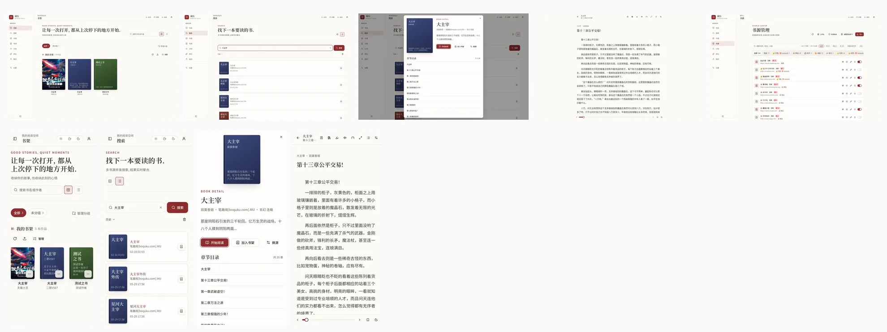
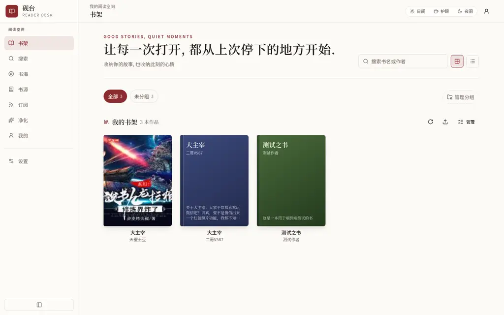
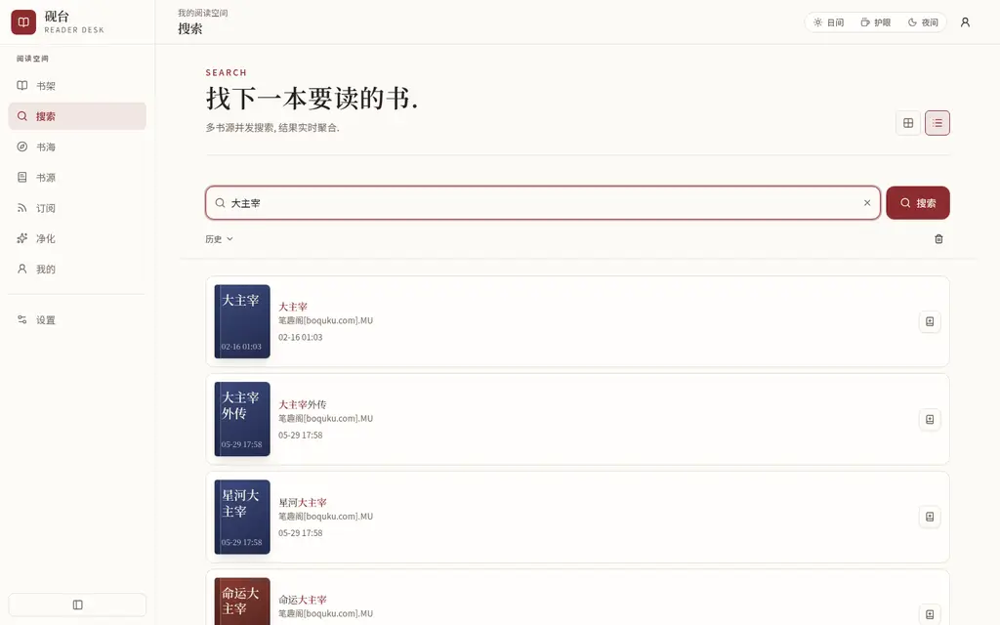
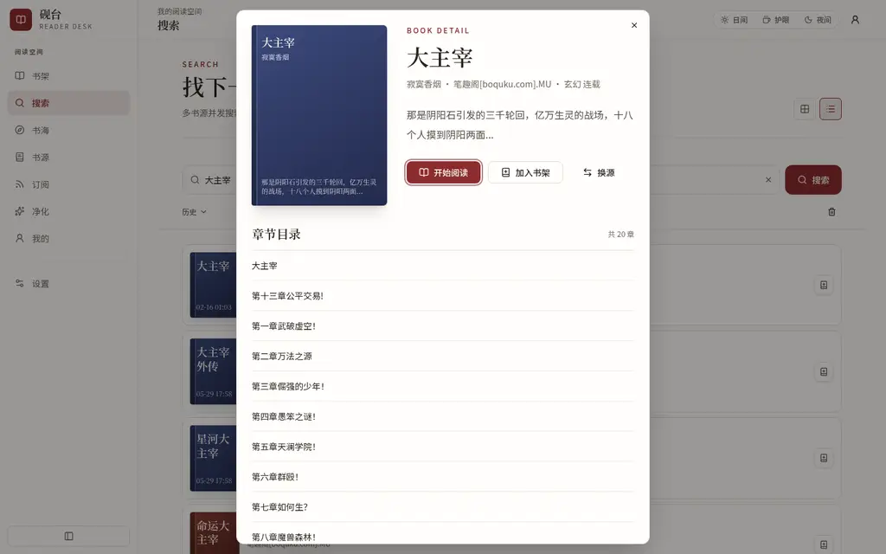
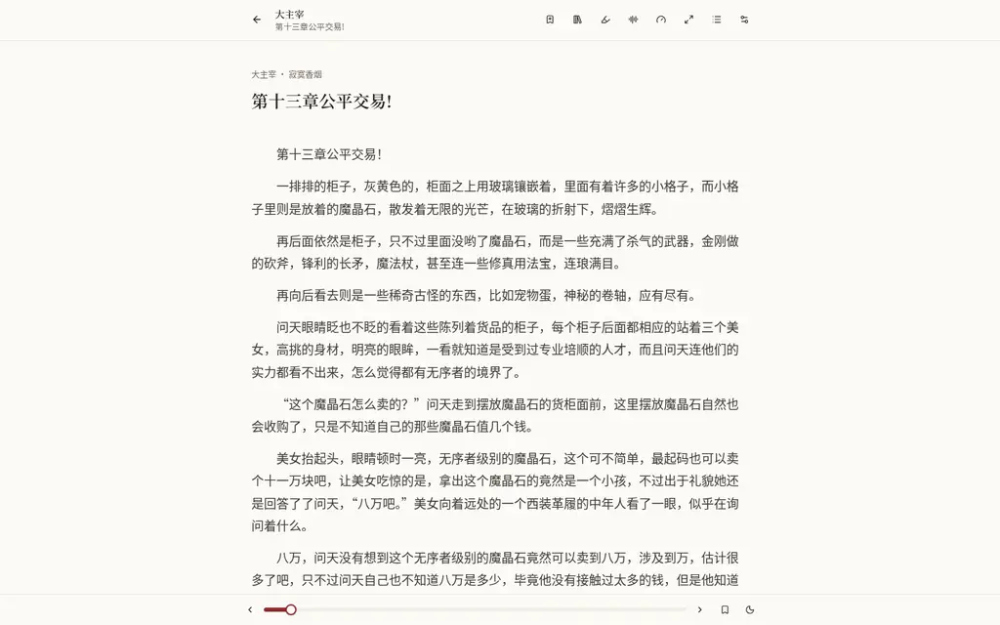
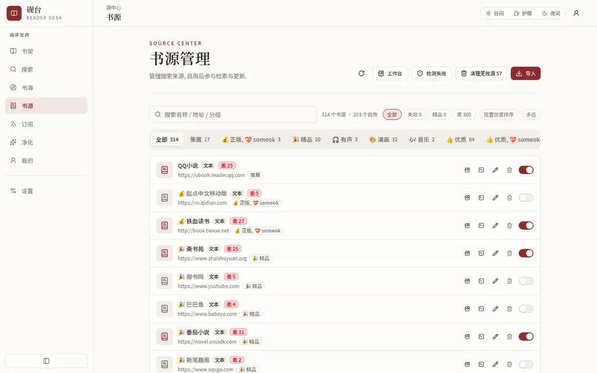
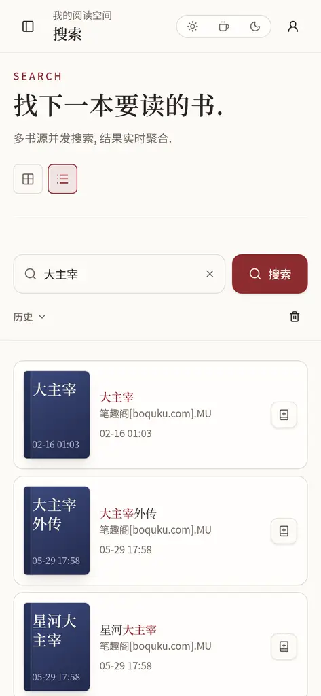

<div align="center">

# reader

**自托管在线阅读服务 —— 多源搜索 · 书架 · 阅读器 · 换源 · 双向缓存 · TTS 朗读**

Rust(warp) 后端 + React 前端, 单一仓库 · GitHub Actions 构建 · GHCR 分发
legado 语义书源规则引擎, 从 Kotlin legacy 全量重构而来

</div>

---

## 目录

- [重构亮点](#重构亮点)
- [功能特性](#功能特性)
- [性能实测](#性能实测)
- [快速开始](#快速开始)
- [生产部署](#生产部署)
- [环境变量](#环境变量)
- [仓库结构](#仓库结构)
- [构建与发布](#构建与发布)
- [旧部署迁移](#旧部署迁移)
- [开发须知](#开发须知)

---

## 重构亮点

相对 legacy(Kotlin + Vue)与常见 fork, 这一版把「搜得到」升级为「搜得快且搜得准」, 把「能读」升级为「读得顺」:

| 维度 | legacy / 常见实现 | 本仓库 |
|---|---|---|
| 技术栈 | Kotlin + Spring + Vue, 前后端分离双仓库 | **Rust(warp) + React 单仓库**, 镜像一次构建前后端齐备 |
| 搜索排序 | 书源配置顺序, 死源慢源挡在前面 | **置信度排序**: 质量分(成功率/目录/正文/丰富度) × 速度因子, 死源 6h 自动跳过 |
| 搜索体验 | 全源跑完才出结果 | **SSE 流式聚合**, 热门词首结果 0.3-0.6s; 结果按「书名/作者/简介含关键词」收口, 不混站内推荐垃圾 |
| 预览返回 | 列表丢失重搜 | **会话快照**: 退出阅读器/详情页返回, 原列表与书源游标即时恢复, 可续搜 |
| 未入架阅读 | 点章节先静默加入书架 | **直读不入架**: URL 携带书源提示直接进阅读器; 换源为纯前端身份切换, 书架零污染 |
| 目录性能 | 每次开书重抓目录页 | 目录缓存 24h + **缓存前置检查**(命中 35ms); 独立目录页源的 tocUrl 推导结果持久化, 二次打开 51ms |
| 部署 | 本机编译/手工镜像 | **GitHub Actions → GHCR**, 服务器 `pull-deploy.sh` 一条命令更新, 本机零编译 |

---

## 功能特性

### 搜索与书源治理

- **多源 SSE 流式搜索**: 逐源完成逐批推送, 进度可见(已找到 N 本 · 书源 x/y), 随时停止/续搜
- **置信度排序与死源跳过**: 每源记录搜索/目录/正文成功率、延迟、简介丰富度; 置信度 = 质量分 × 速度因子; 连败源 6h 跳过到期放行探针(`all=1` 强制全搜)
- **相关性收口**: 聚合前过滤「书名/作者/简介都不含关键词全部token」的结果, 搜「大主宰」不再混入「山村小神医」类站内推荐
- **书源管理**: 增删改/启停/分组/导入导出; 源工作台逐规则调试(搜索/目录/正文 SSE 流式日志); 失效源标记与展示
- **换源**: 书架书走后端换源(保留当前章进度); 未入架书纯前端切换(详情/目录/阅读全跟新源, 不动书架); 候选含搜索多源复核与不可达源灰行说明
- **legado 语义规则引擎**: CSS/JSONPath/XPath/正则/JS 沙箱, `@put/@get` 书级变量贯通搜索→详情→目录→正文

### 阅读

- 主题(亮/暗/护眼/跟随系统)、字号/行距/段距/宽度、沉浸模式、自动滚动、键盘翻页
- **TTS 朗读**(同源 TTS 网关代理, 跨设备/https 混合内容无坑)
- 书签 + **划选批注**(抽屉管理); 章末块(上下章导航/纯标记切换)
- 阅读进度云端同步, 书架卡片显示上次阅读章节
- 正文/目录/书籍信息多级缓存, 未命中自动抓取并回写

### 书架与缓存

- 书架分组、网格/列表布局、封面(自定义封面长缓存)
- **缓存层级**: 目录(24h TTL, 前置命中 35ms) · 正文(永久, md5(chapterUrl) 键, 多端共用) · 书籍信息(24h) · 搜索批次
- 搜索列表会话快照(sessionStorage), 预览返回零等待

### 本地书与导出

- 本地书监听目录自动导入(epub/txt/mobi/azw3/pdf/fb2/docx/cbz/umd), 手动上传导入
- 导出 TXT/EPUB(内嵌中文字体 + 完整目录导航)
- WebDAV 备份/恢复(幂等, 兼容 legacy 备份)

### 多用户与安全

- 命名空间隔离(书架/书源/进度/缓存按用户)
- secure 模式: 邀请码注册 + 管理密码; token 鉴权; SSRF 防护开关
- 验证码/登录墙: 容器内 camoufox(Firefox 内核)按需 spawn 求解

### 前端

- React + Vite + Tailwind, 响应式(移动端竖屏阅读适配), 深色主题
- 路由级代码切分; SSE 流式 UI; 命令式搜索历史/快照恢复
- 书源工作台、净化规则、RSS 订阅、书源统计(置信度/成功率)

---

## 性能实测

本机(4 核)直连后端, 缓存命中路径, median of 3:

| 功能点 | 时延 | 说明 |
|---|---|---|
| 书架列表 | 3-6ms | sqlite 单文件 |
| 正文(缓存命中) | 17-35ms | md5 键直取 |
| 目录(缓存命中, 1760 章) | **35ms** | 缓存前置检查, 免抓书页 |
| 目录(独立目录页源, 二次打开) | **51ms** | tocUrl 推导持久化 |
| 书源列表(轻量变体) | 69ms / 44.6KB | 搜索页/弹窗专用; 全量 1.4MB 仅书源页 |
| 搜索首结果(热门词, 全链路 HTTPS) | **0.3-0.6s** | 置信度排序后快源居前 |
| 书签/进度保存 | 5-10ms | |

修复前对照: 目录命中 1.5-3.3s(每请求白抓一次书页) · 搜索首结果 30-60s(死源挡前) · 预览返回重搜全量。

---

## 快速开始

### Docker(推荐)

```bash
docker pull ghcr.io/hehecat/reader:latest
docker run -d --name reader -p 8080:8080 \
  -v "$PWD/storage:/storage/storage" \
  -e READER_APP_WORKDIR=/storage \
  -e READER_APP_SECURE=true \
  -e READER_APP_INVITECODE=<邀请码> \
  -e READER_APP_SECUREKEY=<管理密码> \
  ghcr.io/hehecat/reader:latest
```

镜像内置 camoufox 求解后端(pip 包 + Firefox 二进制), 反爬开箱即用。
容器自身同时服务前端静态与全部 API(单一来源), 浏览器打开 `http://<host>:8080` 即可, **无需任何反代**。

### 本地开发

```bash
# 后端 (flag 必需: reqwest http3 实验特性)
cd backend && RUSTFLAGS='--cfg reqwest_unstable' cargo run

# 前端 (代理 /reader3 → 127.0.0.1:4396, 端口 8082)
cd frontend && pnpm install && pnpm dev
```

---

## 生产部署

### 通用场景(推荐)

容器单端口直服(静态 + API 同源), 前面挂任意 TLS 反代即可:

```
浏览器 ─HTTPS 443─ 你的反代(caddy/nginx/traefik, 自备证书)
       ─HTTP────── reader 容器 :8080 (静态 dist + /reader3 API + /assets 封面)
```

compose 方式(`deploy/docker-compose.yml`, 端口可用 `READER_PORT` 改):

```bash
cd deploy && cp .env.example .env && docker compose up -d
```

反代只有两条硬要求(SSE 流式搜索的性命):

1. **不要压缩 SSE**: 反代层对 `/reader3/searchBookMultiSSE`、`/reader3/searchBookSourceSSE` 关闭 gzip/zstd(压缩器会缓冲 event-stream, 表现为搜索永远 0 结果)。caddy: `@notsse not path /reader3/*SSE` + `encode @notsse gzip zstd`; nginx: 该 location `gzip off`
2. **关闭该路径的代理缓冲**: caddy `reverse_proxy { flush_interval -1 }`; nginx `proxy_buffering off`

其余路径(含 `/assets/*` 静态与封面)容器已自带合理缓存头, 反代透传即可。

### 特殊场景: 本机家庭拓扑(作者自用, 仅供参考)

家庭宽带无 80/443、通配证书挂在 **:8888**, 且希望静态资源由宿主 caddy 做长缓存并与 TTS 网关同域, 因此采用两级反代:

```
浏览器 ─HTTPS :8888─ 外层 caddy 容器(TLS 通配证书, SSE 不压缩)
       ─HTTP :8080── 宿主 caddy(静态 deploy/web-dist 长缓存 + /reader3 反代 flush -1)
       ─4396→8080── reader 容器(compose, READER_PORT=4396)
```

该拓扑的全部资产在 `deploy/`: `Caddyfile`(宿主活配置, 文件头有动机注释)、`pull-deploy.sh`(拉镜像 → 导出 dist 到 `deploy/web-dist` 供宿主 caddy → compose up → 旧 volume 迁移)。**通用部署不需要这两样**, 直接用上节 compose 即可。

## 环境变量

| 变量 | 默认 | 说明 |
|---|---|---|
| `READER_APP_WORKDIR` | 当前目录 | 数据根(sqlite/封面/本地书在其 storage/ 下) |
| `READER_APP_WEB_ROOT` | `web-ui/dist` | 前端静态根(镜像内已含) |
| `READER_APP_SECURE` | false | 多用户 secure 模式开关 |
| `READER_APP_INVITECODE` | - | 注册邀请码 |
| `READER_APP_SECUREKEY` | - | 管理密码 |
| `READER_TOC_CACHE_TTL_MS` | 86400000 | 目录缓存 TTL |
| `SSRF_ALLOW_PRIVATE` | false | 允许抓内网地址(本地书同步/TTS) |
| `READER_CAMOUFOX_URL` | - | 外置 camoufox 服务; 缺省容器内自 spawn |
| `READER_BROWSER_FIRST` | 1 | 抓取优先经浏览器反检测; 0 恢复直连优先 |

---

## 仓库结构

```
backend/    Rust 后端: src/(api/service/parser/storage/model), .cargo/config.toml
            (reqwest_unstable flag), scripts/camoufox_solver.py, web-ui/public/fonts(epub)
frontend/   React 前端: src/(pages/components/hooks/services), vite.config.ts(/reader3 代理)
deploy/     docker-compose.yml · .env.example · pull-deploy.sh
            Caddyfile(作者家庭两级反代自用配置, 通用部署可忽略)
Dockerfile  根上下文多阶段: pnpm build → cargo release → camoufox → 运行镜像
.github/    workflows/build.yml: push main/tag → 构建推 GHCR(latest/main/sha/semver)
```

---

## 构建与发布

- push `main` 或 tag `v*` → Actions 构建镜像推 `ghcr.io/hehecat/reader`(GHA 层缓存, 增量构建约 2 分钟)
- 标签: `latest`(main 分支) · `main` · `sha-<full>` · semver(tag)
- 服务器更新: `deploy/pull-deploy.sh`(拉镜像 → 导 dist → compose up), 回滚改 image tag 为旧 sha 即可

---

## 旧部署迁移

1. **legacy(Kotlin)JSON 数据**: 首次启动自动全量迁移至 SQLite(书/书源/书签/规则/RSS/分组/配置), 原文件保留可回退
2. **旧 docker run 容器**: `pull-deploy.sh` 自动停删同名手工容器并接 compose; 旧匿名 /data volume 用 `OLD_DATA_VOLUME` 迁移
3. **宿主 caddy**: 配置收在 `deploy/Caddyfile`, root 指向 `deploy/web-dist`; 切换 = 重启 caddy 进程指向该文件

---

## 开发须知

- 后端编译**必须**带 `RUSTFLAGS='--cfg reqwest_unstable'`(reqwest http3 实验特性; `.cargo/config.toml` 已写但部分环境不拾取)
- 前端包管理 pnpm(lockfile v9); 新增 API 消费注意 `bookSource`(单源搜索/正文) 与 `bookSourceUrl`(SSE) 参数名差异
- SSE 相关改动务必真机验证流式(压缩/缓冲是历史事故高发区)
- 书源规则调试用前端「书源工作台」, 逐规则 SSE 日志

---

## 界面

一张海报看全貌(上排 PC 1440×900 · 下排移动 390×844):



### PC 端

| 书架(网格/分组/未读角标) | 多源搜索(SSE 流式·关键词高亮) |
|---|---|
|  |  |
| **详情与章节目录(多源徽标·换源)** | **阅读器(主题·批注·TTS·沉浸)** |
|  |  |

书源治理页(置信度/成功率/延迟):



### 移动端

| 书架 | 搜索 | 详情 | 阅读器 |
|---|---|---|---|
|  |  |  |  |

---

## 致谢

- [legado](https://github.com/gedoor/legado): 书源规则语义与生态
- [reader(warpdotsys)](https://github.com/warpdotsys/reader-dev): Rust 重写路线参考
- [hectorqin/reader](https://github.com/hectorqin/reader): legacy 服务器版起点
